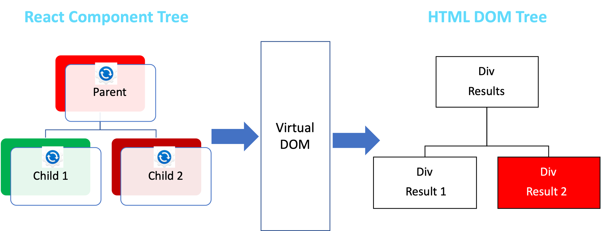
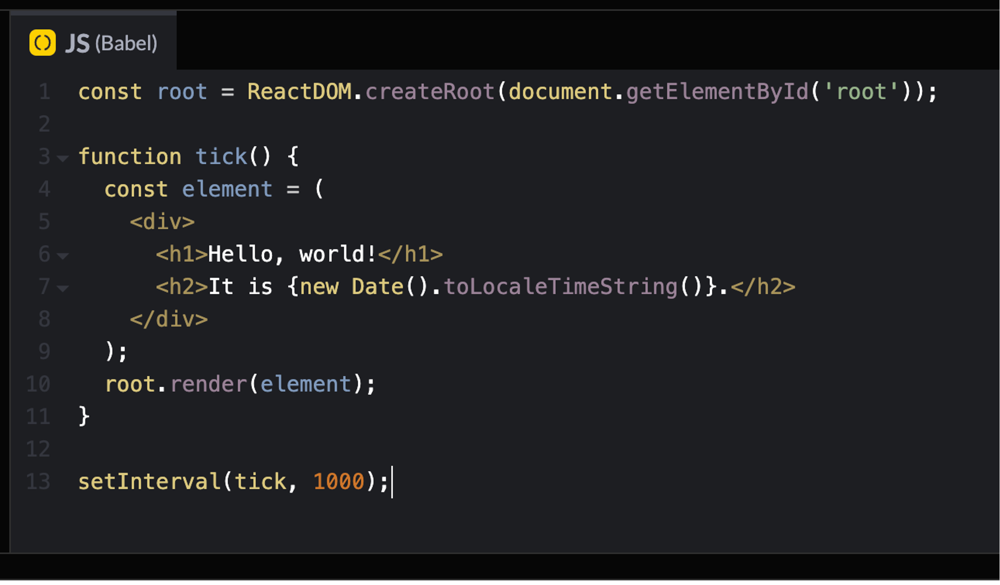

# Virtual DOM

## What is the Virtual DOM?

The **Virtual DOM (VDOM)** is a lightweight copy of the actual **DOM (Document Object Model)**. It helps React update the UI efficiently by reducing direct interactions with the real DOM, which can be slow.

Instead of updating the entire webpage whenever data changes, React uses the Virtual DOM to **calculate the minimal updates** required and applies them efficiently.

---

## How Does the Virtual DOM Work?

1. **Render Phase**: When state or props change, React creates a new Virtual DOM tree.
2. **Diffing Phase**: React compares (diffs) the new Virtual DOM with the previous one to detect changes.
3. **Reconciliation Phase**: React updates only the changed elements in the actual DOM.

---

## Virtual DOM in Action

|                             React Code                              |             Dev Console Output              |
| :-----------------------------------------------------------------: | :-----------------------------------------: |
| 
  
 |  |

## Benefits of the Virtual DOM

✅ **Faster UI updates**: Only updates changed elements, reducing costly DOM operations.  
✅ **Improved performance**: Helps React efficiently manage complex UI updates.  
✅ **Better developer experience**: Easier to reason about UI updates without direct DOM manipulation.

React's **Virtual DOM** makes UI updates more efficient and scalable for modern web applications.
