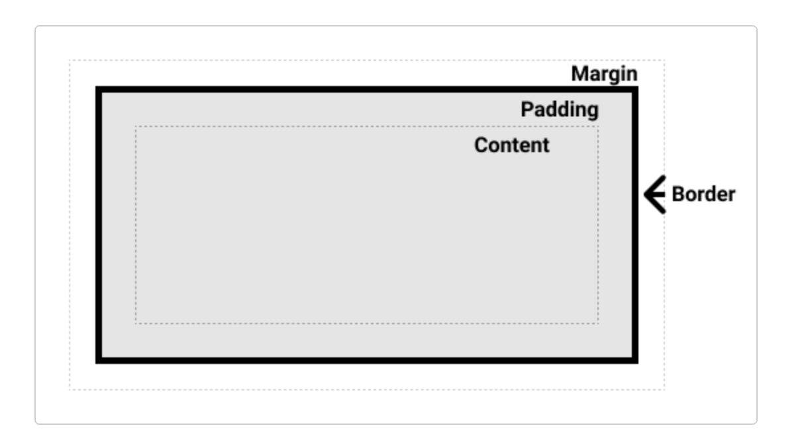

# CSS Box Model


Source: https://developer.mozilla.org/en-US/docs/Learn/CSS/Building_blocks/The_box_model

The CSS Box Model defines how elements are structured and spaced on a webpage. It consists of four main parts:

1. **Content** – The area where text and images appear.
2. **Padding** – Space between content and border.
3. **Border** – Surrounds padding and content.
4. **Margin** – Space outside the border separating elements.

### Box Model Calculation

Total size of an element:

```
Total Width = width + padding (left & right) + border (left & right) + margin (left & right)
Total Height = height + padding (top & bottom) + border (top & bottom) + margin (top & bottom)
```

Example:

```css
.element {
  width: 200px;
  height: 100px;
  padding: 10px;
  border: 5px solid;
  margin: 20px;
}
```

Total Width = **270px**, Total Height = **170px**

### Box-Sizing Property

- **content-box** (default): Width & height include only content.
- **border-box**: Includes padding & border within specified width & height.

```css
.element {
  box-sizing: border-box;
}
```

### Summary

The CSS Box Model controls layout spacing, making designs predictable and consistent. Learn more at [MDN Web Docs](https://developer.mozilla.org/en-US/docs/Learn/CSS/Building_blocks/The_box_model).
