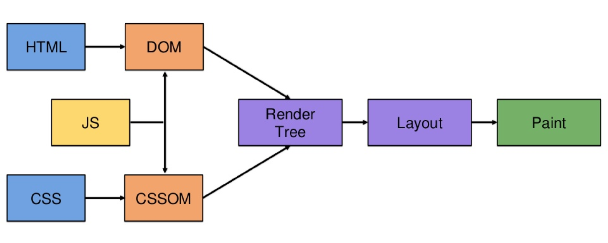

# How Browser Works



```html
<!DOCTYPE html>
<html>
  <head>
    <title>Web Fundamentals</title>
    <link rel="stylesheet" href="styles.css" />
  </head>
  <body>
    <h1>Hello, Web!</h1>
    <script src="script.js"></script>
  </body>
</html>
```

When you enter a URL in your browser and press **Enter**, several steps happen behind the scenes to load the webpage. Let's break it down:

## 1. DNS Resolution

The browser first converts the domain name (e.g., `example.com`) into an IP address using the **Domain Name System (DNS)**.

This IP address is used to locate the web server hosting the requested website.

## 2. HTTP Request and Response

The browser sends an **HTTP request** to the server asking for the webpage.

The server processes the request and responds with an **HTML file**.

## 3. Rendering the Webpage

Once the browser receives the HTML file, it follows these steps:

### Step 1: Parsing the HTML

The browser **parses** (reads) the HTML and constructs the **DOM (Document Object Model)**.

If it encounters `<script>` tags, it may pause and fetch JavaScript files.

### Step 2: Loading and Applying CSS

The browser downloads CSS files and applies styles to the corresponding HTML elements.

It builds the **CSSOM (CSS Object Model)** and combines it with the DOM to create the **Render Tree**.

### Step 3: Executing JavaScript

JavaScript files are downloaded and executed.

JavaScript can manipulate the **DOM**, modify styles, or fetch additional data.

### Step 4: Layout and Painting

The browser calculates the size and position of elements (**Layout process**).

It then converts this layout into **pixels on the screen** in the **Painting process**.

## Summary

- The browser fetches **HTML**, **CSS**, and **JavaScript** files from the server.
- It constructs the **DOM and CSSOM**, then merges them to build the **Render Tree**.
- JavaScript can manipulate the page dynamically.
- The browser performs **layout calculations** and **paints the UI** to display the final result.

Understanding this process helps in optimizing web performance and debugging UI issues effectively! 🚀
