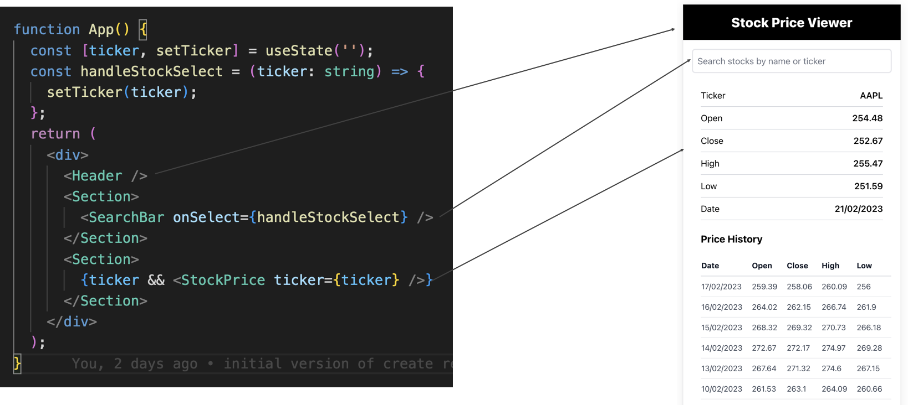

# Component-Based Architecture

## What is Component-Based Architecture?

React follows a **component-based architecture**, which means the UI is divided into **independent, reusable components**. Each component manages its own logic and state, making development more **modular, scalable, and maintainable**.

---

## Example: Breaking Down a Stock Search UI

Instead of writing a **single large UI file**, React encourages breaking it into smaller components:

## Why Use Components?

- **Decomposes complex UI** into smaller, manageable pieces.
- **Encapsulates logic and styles** within each component.
- **Reusability**: Components can be used in multiple places, reducing code duplication.
- **Easier testing and debugging**: Individual components can be tested separately.

---

