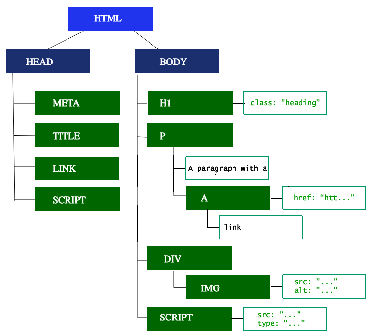

# Document Object Model (DOM)

The **Document Object Model (DOM)** is a programming interface for web documents. It represents the page structure as a tree of objects, where each object corresponds to a part of the document, such as an element or an attribute. The DOM allows programming languages like JavaScript to interact with HTML and XML documents dynamically.

## Key Concepts

- **DOM Tree**: The structure of the document is represented as a tree, where each node is an object representing a part of the page.
- **Elements**: HTML tags like `
`, `
`, and `<button>` are elements in the DOM.
- **Nodes**: Each element, attribute, and piece of text in the document is a node.
- **Dynamic Updates**: You can modify, add, or remove elements dynamically using JavaScript via the DOM.

